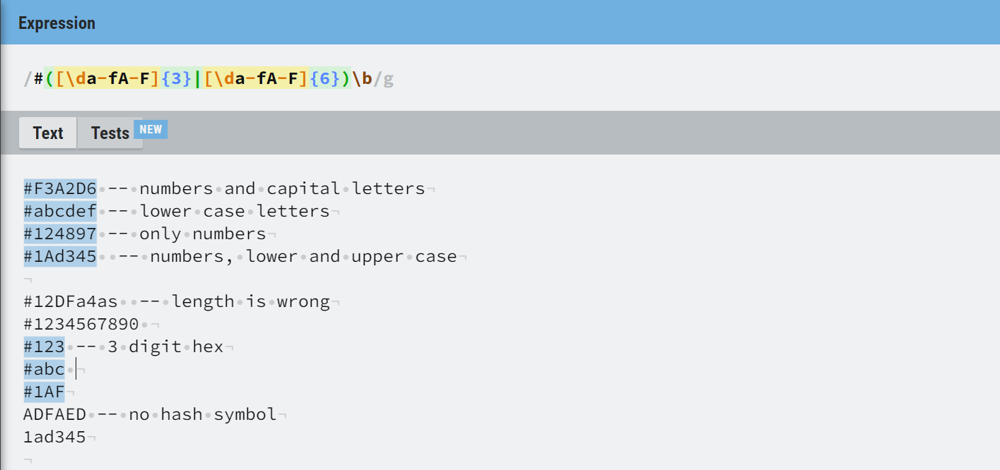
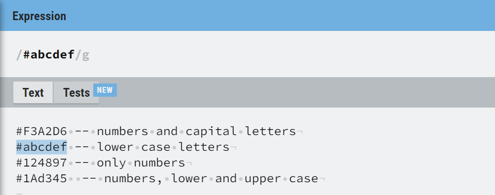
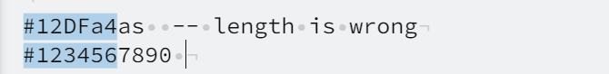

# Regex for Validating HEX codes

---

## Table of Content
- [Summary](#summary)
- [Characters](#characters)
- [Boundaries](#boundaries)
- [Alternation](#alternation)
- [Grouping and Quantifying](#grouping-and-quantifying)
- [Character Classes](#character-classes)
- [Flags](#flags)
- [Author](#author)

---


## Summary

Regex or **regular expressions** is a powerful tool that allows us to define a search pattern that is to be executed inside the body of a text. We do so by stringing together a sequence of characters.

The most common uses for this tool is 
* Validation of certain strings
* Find and Replace

One of the drawbacks of Regex is, usually the aesthetic aspect. They can sometimes seem intimidating. Take a look at this example:

-  This search pattern validates a Color Hex value. Filtering out the ones that are not properly declared.




As seen in the example above, RegEx is usually declared in between two ```/ /``` characters

What makes RegEx so powerful as a search tool, is the use of **Meta Characters**, which are a combination of characters or symbols that do not indicate a a single literal character but more of a generalized idea of what we are looking for. 

Without these **meta characters**, regex would be no different from the simple 'find' functionality.



Imagine that you are reading through some documentation and the document is riddled with HEX codes scattered here and there. The example above  would be an invaluable tool to  help you scoop these codes out of the document and maybe create a list of all of them. 

Let's take a look at how this search pattern works.

```

/#([\da-fA-F]{3}|[\da-fA-F]{6})\b/g

```


## Characters

``` # ```

The hash symbol in this expression is not being used as any metacharacter, but its use is very important. This declares that all acceptable HEX codes will begin with  this character. 


``` \d ```

The use of these meta characters indicates that we are looking for any digit between 0-9. More information in the Character Classes section.

## Boundaries
``` \b ```

This character represents a Word Boundary. This is useful for trying to match a sequence of characters on their own. For example:

* If you would like to select the word **apple** from a text, you would use the boundaries in the next fashion:
~~~
\bapple\b
~~~

* If you would like to select the word apple from the work **pineapple**, you would remove the boundary at the beginning  of the word in the next fashion:
~~~
apple\b
~~~

In our case, ```\b``` boundary is being used at the end of the sequence because it helps us guarantee that the search sequence will stop validating sequences longer than the number of characters we are looking for (3 or 6).

if we were to remove the current boundary or place it at the beginning of the search sequence, the following sequences would be accepted as valid hex codes:

.


## Alternation

```|```

The vertical bar character acts as a separator for two options. This operator can help us execute one grouped pattern of instructions or the other.

Since HEX codes can be declared as 6  characters long or shortened to 3 characters, we needed to indicate that these two lengths are acceptable in our search for validation. 


## Grouping and Quantifying

```( )```

Parentheses are used to group the regular expression in between them. This provides the ability to perform individual operations with the group. This is the reason that we can use our expression to look for pairs.


``` {n} ```

The {} quantifier operators are being used to execute the grouped expression either 6 times or 3 times, which are the two accepted lengths of a HEX expression. The quantifier controllers can take any number as a parameter inside the brackets and execute the query on the preceding group or expression for the indicated number of times.

## Character Classes

```[ ]```

A “character class” is very helpful to use for instructing Regex to match a range of characters. In this case, we are encompassing a few possible ranges by using a hyphen between the two extremes.

* ```\d``` this is the same as writing  0-9

* ```a-f``` a range that accepts anny letter from a to f (lowercase)

* ```A-F``` a range that accepts any letter from A to F (uppercase)

The order in which you enlist your parameter does not matter.


## Flags

Finally, the letter ```g``` at the end of the expression denotes the flag called **Global**. This flag lets us know that the search pattern will be executed in the totality of the document and will identify all possible matches as opposed to the default behaviour, which is to stop looking after the first result.

---

## Author

Please visit my [GitHub](https://github.com/isaiasqb) for more information about me.